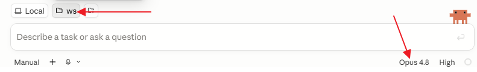

# Lesson 2 — Design with HTML and JavaScript

**Day 1 · 9:00–10:00 · Vagisha**

You build an **interactive HTML page of your own published papers, with charts of
how your citations have grown over time**, and put it on a live web address you can share.

In this session you will

- find your ORCID and pull your papers from OpenAlex, checking they are really yours
- design the page by describing what you want and letting Claude interview you
- build it, refine the look, and publish it live with GitHub Pages
- **stretch goal** — fold the whole workflow into a reusable tool you can run for anyone

**All you have to do is explain.** You bring the decisions, Claude does the fetching, the building, the
publishing.

Each step below lists **what to ask for**, and leaves the wording to you.
Turn the intent into a message for Claude. Do not aim for perfect wording. If you are unsure about something, **have Claude ask you questions so you can brainstorm**.

> **Where you should be.**
> - Signed in to GitHub.
> - Claude Desktop open on your `ws` folder, on its **Code** tab.
> - Python installed, which Claude uses behind the scenes to fetch your papers.
> - Your folders from Lesson 1 look like the tree below.

```
ws/                  your working folder, open in the Code tab
├─ .claude/          skills and commands from Lesson 1, where today's skill will land
├─ .tmp/             scratch, outside every repo
├─ CLAUDE.md         points Claude at your ClaudeLab rules from anywhere in ws
├─ ClaudeWorkshop/   the workshop guide, cloned during setup
└─ ClaudeLab/        your repo from Lesson 1
   ├─ CLAUDE.md
   ├─ CRITICAL-RULES.md
   ├─ docs/about-my-work.md
   └─ todos/         active, backlog, completed
```

---

## OpenAlex and ORCID

Your page is built from real data, so two names to know.

**[OpenAlex](https://openalex.org)** is a free, open catalog of the world's published research. For almost
every paper it knows the authors, the venue, and how many times it has been cited, year by year.
That yearly breakdown is what provides the data for your citation charts. One limit is worth knowing. OpenAlex only breaks citations out by year from about 2012 on. Citations your older papers earned before 2012 still count in the lifetime total, but they are not broken down by year.

**[ORCID](https://orcid.org)** is a free, permanent 16-digit ID that tells you apart from every
other researcher, for example `0000-0002-1825-0097`. We will use your ORCID, not your name, to pull your papers, because names
are not unique. Do not know your ORCID? Give Claude your name and institution and have it look you up in
the **ORCID registry**, which is the place ORCIDs come from.

No ORCID, or too few papers for an interesting page? Follow along with someone else's, a PI or a labmate.
Not sure whose? Use Brendan MacLean at the University of Washington, ORCID `0000-0002-9575-0255`, whose
publication list is a good size for the hour.

## Get set up

A few short setup steps come first.

**Start where Lesson 1 left off, on your `ws` folder.** Claude Desktop should still be open on `ws`, the
root that holds your `ClaudeLab` and the `.claude`, `.tmp`, and `CLAUDE.md` you set up in Lesson 1. Start
a fresh session in the Code tab, and check the folder button reads `ws`, as shown below. Working from `ws`
keeps your Lesson 1 skills and rules in reach the whole time.



**On the Pro plan, switch to Sonnet 5.** Look at the bottom-right corner of that same window. It shows
the model, `Opus 4.8`. On the Claude Pro plan, click it and choose Sonnet 5. Sonnet runs faster and uses
less of your usage limit, so you will not run low over the four-hour workshop. On a Max plan you can stay
on Opus.

**Tell Claude what you are here to build, and how you want to work.** Your very first message
names the session, so make it about the work. It is also the moment to set the tone. Tell Claude this
is a multi-step job and to wait for your okay at each step, so it does not race ahead. Something like
this, in your own words.

> *"I would like to build a web page of my published papers, with charts
> of how my citations have grown over the years, and publish it live so I can share it. This is a
> multi-step process. Wait for my approval at each step before moving on to the next."*

**Make a repository for today's page.** In your `ws` folder, next to `ClaudeLab`, you make a new repo for
this project. Ask Claude, in your words.

> *"Make a folder called MyPublications here, make it a git repository, and push it to GitHub as a public
> repository. Keep everything for this project inside it. Save any code you write as reusable scripts I
> can run again."*

Now `ws` has a `MyPublications` repo next to `ClaudeLab`, and it fills up as you go.

```
ws/                          your working folder, open in the Code tab
├─ .claude/                  skills and commands from Lesson 1
├─ .tmp/                     scratch, outside every repo
├─ CLAUDE.md                 points Claude at your ClaudeLab rules
├─ ClaudeWorkshop/
├─ ClaudeLab/                your repo from Lesson 1
└─ MyPublications/           today's new repo, pushed to GitHub
   ├─ TODO-YYYYMMDD-page.md    your spec, created next and kept current
   ├─ fetch_papers.py          the script Claude writes to pull your papers
   ├─ papers.json              your fetched, checked publication list
   └─ index.html               your page, built later
```

**Start a spec (TODO) for the work.** It is your running plan and your map through the hour. You start it now with just the goal, and Claude keeps
it current as you go, so if you lose the thread you can see where you are and pick back up. **Ask Claude
to**

- start a spec in the `MyPublications` folder, at its top level, named `TODO-YYYYMMDD-...` the Lesson 1 way
- put in the goal for now — a page of your papers with citation charts, published live
- keep it up to date as you go, noting what it learns at each step, so the work can be re-run later

Because the spec lives in `MyPublications`, it gets committed right alongside your page, so your plan and
your work travel together in the one repository.

**One last bit of setup, before Claude runs any Python.** Paste this as its own message.

> *"For anything you do in this session, run Python with `-X utf8`."*

Claude uses Python to fetch and write a local list of your papers. Titles and names are full of special
characters, like the Greek letters α and β, and by default Python on Windows stops with an error the first
time it tries to write one to a file.

## Your ORCID

Skip this if you know your ORCID. If not, have Claude find it from your name and institution, and
**give you the link to the ORCID record so you can open it and confirm the name and institution are
yours** before going on. A wrong ID means a page full of someone else's work.

## Your papers from OpenAlex, and check they are yours

Have Claude pull your full publications list from OpenAlex, then do the part that matters, **check it.** Even the
right ORCID is not foolproof. When I searched Michael MacCoss's, OpenAlex handed back two papers by
a different researcher, Malcolm MacCoss. Someone who shares your last name can turn up in your
results, so this is where you catch it, before anything is built on top.

Do this in two steps.

**First, fetch.** Tell Claude what you are building, a page of your papers with charts of your
citations over time, so it knows what to pull. **Ask Claude to**

- fetch all your works from OpenAlex by your ORCID, with the details that page needs — the venue, the year, the work type, a link to each paper, and how often each was cited each year — and save them
- **if OpenAlex is busy and asks it to slow down, wait a moment and try again instead of failing**
- also save the list to a spreadsheet you can open and skim, with the title, year, venue, type, and co-authors for each paper, so you can check the results with your own eyes.
- ask you questions if anything is unclear
- show you a short summary once it is done — how many works, and a breakdown by type (article, review, preprint, and so on)

**Why ask for the wait.** OpenAlex caps how many requests it will handle per second, so a quick burst can
hit that cap and it asks the program to slow down for a moment. Telling Claude to pause and retry means
that does not stop you, and your fetch just takes a few seconds longer.

Skim the breakdown and tell Claude which kinds to keep. Dropping **preprints** is usually a good call,
since the published version of the same paper is already in your list, so it tidies things and clears
out the duplicate pairs in one move. Keep them if your preprints matter to you — it is your page.

**Then, check.** Open the spreadsheet Claude saved and read down the list yourself. This is the part
that matters. Pull out anything that is not yours, a title from a different field, or a paper with none
of your usual co-authors. Tell Claude which ones to drop. It cleans up the list and remembers your
choices, so a re-run drops them again. Then tell Claude to update the spec and **commit it**.

> **Tip, hundreds of papers, too many to read one by one?** Have Claude do a first pass. This is where
> steering pays off. Left on its own, Claude can spend several minutes rediscovering what a wrong paper
> looks like, and over-build a one-off script. Tell it up front what to watch for. Paste this, and swap
> in whatever a wrong paper looks like for you.
>
> > *"My list is long, so do a quick first pass to catch anything that might not be mine. Look for
> > papers with an author who shares my last name but none of my usual co-authors. Show me what you
> > find, most likely first, before you build a polished script for it."*
>
> Even this pass can take a few minutes. When it finishes, you still read the results yourself, the
> flagged ones first, then a skim of the rest.

## Design the page

Do not spell out the design, unless you really want to. Start the other way and let Claude interview you. **Ask Claude to**

- ask you about 10 questions before it builds anything

Claude asks about the look, the accent color, the numbers to feature, the charts. **"You decide" is a
fine answer**, and you can change anything later.

When the questions run out, have Claude fold your answers into the spec you started at the beginning, so
it grows into the full plan for your page. **Ask Claude to**

- add the design to your spec from your answers, the layout, the accent color, the numbers to feature, the charts
- wait for you to approve the plan before building anything

Review the plan. Fixing a plan is quick. When it looks right, say **"commit it."**

Now tell Claude to build `index.html`. The spec and the page are **the demo**, your explanation made
real. **Open the file in your own browser and review it.**
**Commit** this first version. The commit lands in `MyPublications`.

## Make it yours

This is the design heart of the hour. Look at the page, tell Claude what to change, refresh, review
again. Color, headings, a dark-mode toggle, another chart, a link from each title to its DOI,
whatever you want. It is a conversation, not a form. Say what looks wrong and what you want instead. Want a chart but are not sure
which kind? Have Claude suggest a few and pick one. If something looks empty or off, say so.
**Commit** when it looks right.

**Falling behind?** A couple of changes is plenty. Getting the page live is the goal, so skip ahead to
publishing whenever you are happy enough, and come back to refine it later.

## Put it online

**GitHub Pages** turns your repository into a live website, for free. Your page is a single `index.html` at the **repository root**,
exactly where Pages looks, and the repository is already **public**, which is all Pages needs.

Do it in two steps, and let the first finish before the second. Turning on Pages while a commit is
still landing on GitHub can bring the site up before your latest page is there.

**First, push.** **Ask Claude to**

- push anything you have not pushed yet, and confirm it has all landed on GitHub

**Then, turn on Pages.** Once the push is done, **ask Claude to**

- turn on GitHub Pages for the repository and tell you the live URL
- ask questions if anything is unclear

Claude runs each step and waits for you. Most of the time Claude can turn on Pages for you. Just in case
it cannot, because Pages lives in the repository's settings on the GitHub website, you can turn it on
yourself in under a minute.

1. Open your repository on GitHub and click **Settings**.
2. In the left sidebar, click **Pages**.
3. Under **Build and deployment**, set **Source** to **Deploy from a branch**.
4. Set the branch to **main** and the folder to **/ (root)**, then **Save**.

A minute or two later your page is live at `https://<your-username>.github.io/MyPublications/`. Share the link with anyone.

Your page is live, so the spec is done. Tell Claude to mark it complete and **commit it**. That is the
last commit, and like all the others it lands right here in `MyPublications`, next to the page it planned.

**Optional, keep a record with your other work.** Your `ClaudeLab` from Lesson 1 sits right next to
`MyPublications` under `ws`, and it is where you track everything you do. So you can also ask Claude to
copy your finished spec into its `todos/completed` folder and commit it there, keeping all your own work
in one place.

## Turn it into a tool (stretch goal)

**A stretch goal.** If you are running low on time, skip it, your live page already stands on its own.
Come back to it any time.

The payoff. You did not just make a page, you made all the parts of a page-maker — a fetch script, an
exclusions list, and a page design template you can reuse. Fold them into a **skill** you can run for
anyone, your PI, a labmate. **Ask Claude to**

- package this into a publications-page skill that takes a name or ORCID and an organization, and save it in your `ws/.claude/skills` folder, the one from Lesson 1
- reuse your fetch script, and turn your page into a template, keeping both in the skill folder so it stands alone
- not re-interview you, but always confirm the ORCID first and show you the paper list to check before
  building

Your prompt could simply be:

> *"Turn the work we did in this session into a publications-page skill, saved in my ws/.claude/skills
> folder. It takes as input a name or ORCID and an organization, and produces a standalone HTML page."*

Claude saves the skill in your `ws/.claude/skills` folder, the skills home you started in Lesson 1, so it
is available across everything you do in `ws`, not just this one page. This is the ground Lesson 1 set up
for exactly this moment.

```
ws/.claude/                skills and commands, from Lesson 1, shared across your ws work
└─ skills/
   └─ publications-page/
      ├─ SKILL.md          the steps Claude follows
      ├─ fetch_papers.py   your fetch script, reused
      └─ template.html     your page, as a template
```

The rule is **bake in the design, re-check the facts.** The slow parts, the interview and the look,
get frozen into the template. The two things it must never skip, confirming the ORCID and checking the
papers, stay as quick checks, because skipping them publishes a page from unchecked data.

To try it now, just ask Claude in words to run it, for example *"run the publications-page skill for
my PI."* No slash needed, it runs right away. Run `/reload-skills` and it appears in the type-ahead menu as `/publications-page`, no restart needed.
Refreshing your own page is then seconds. Building one for your PI is a couple of minutes, the paper check still happens, but the design work is gone.

## Keep going (or if you have time)

- **Refine the page.** Add more stat cards, another chart like papers per year, or a one-line intro about
  you or the lab under the title.
- **Make the page keep itself current.** This is the fun one. Have Claude set up a GitHub Action that
  re-fetches from OpenAlex on a schedule and republishes, so your citation counts stay up to date on their
  own, with no work from you.

## You're on track when

- [ ] You checked your fetched papers and dropped any that were not yours.
- [ ] A page of your papers with at least one chart is open in your browser.
- [ ] It is live at a `github.io` address you can share.
- [ ] Your spec is committed in your `MyPublications` repo and marked done.
- [ ] (Optional) You copied your finished spec to `ClaudeLab/todos/completed`, keeping all your work in one place.
- [ ] (Stretch) You packaged the workflow into a `/publications-page` skill in `ws/.claude/skills`.

## What you take with you

- A live, shareable page you built by describing it, not by coding it.
- The reflex to **check what Claude did**, especially when it tells you it succeeded.
- The design loop, look, ask, look again.
- If you reached the stretch goal, a `/publications-page` skill that turns your one-off page into **a page-maker for anyone.**

---

*Snagged? Nothing here is fragile. Ask Claude to explain the current state, or wave over an
instructor.*
