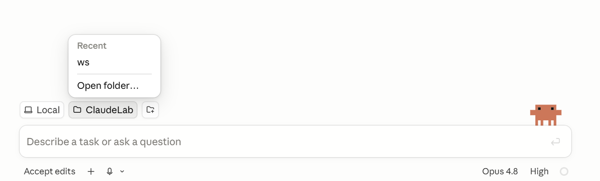

# Lesson 2 — Design with HTML and JavaScript

**Day 1 · 9:00–10:00 · Vagisha**

In this session you build an **interactive HTML page of your own published papers, with
charts of how your citations have grown over time**, and put it on a live web address you can
share with others. You start by gathering your papers and checking they are yours. Then you
continue the **interview → spec → demo** pattern from Lesson 1, explaining your goal to Claude
and having it ask you questions to work out the details.

> **Where you should be.** 
> - You should have a `ClaudeLab` from Lesson 1 sitting in your `ws` folder.
> - You should be signed in to GitHub.
> - You should have Claude Desktop open to its **Code** tab.

---

## OpenAlex and ORCID

Your page is built from real data, so it helps to know where that data will come from and how
Claude finds your work in it.

**[OpenAlex](https://openalex.org)** is a free and open catalog of the world's published research. For almost every paper it
records the authors, where it was published, and how many times it has been cited, with a
year-by-year breakdown. The yearly breakdown is what lets us chart how your citations have
grown. One limit is worth knowing. OpenAlex only breaks citations out by year from about 2012 on.
Citations your older papers earned before then still count in the lifetime total, but they are
not broken down by year. 

**[ORCID](https://orcid.org)**, short for Open Researcher and Contributor ID, is a free, persistent 16-digit
identifier that distinguishes you from every other researcher, for example `0000-0002-1825-0097`. We search
OpenAlex by ORCID rather than by name because names are not unique, so an ORCID is the most reliable way to
pull your papers. If you do not remember your ORCID, give Claude your name and institution, and ask it to
look it up for you.

If you do not have an ORCID, or too few papers for an interesting page, follow along with
your PI's. Give Claude your PI's name and
institution instead of your own, and it finds their ORCID and builds a page from their
publications. For today, Michael MacCoss at the University of Washington is a good one to use.

> Every prompt below is an example, not something to copy and paste. Finish early? Keep refining the
> look, or add new charts to the page. You can even ask Claude for suggestions on how to improve the page.

## Get set up

This lesson's work lives in its own repository, a new folder called **`MyPublications`** that
sits right next to your `ClaudeLab` inside `ws`. Make that empty folder first, since you point
the Code session at it in a moment. You can create it in your file browser, or in the
working-directory chooser you are about to open.

Now open Claude Desktop, go to the **Code** tab, and start a **New session**. The first time
you open the Code tab it asks you to pick a working folder. After that, a new session opens on
the folder you used last, so you may need to switch it. Point this session at your new
**`MyPublications`** folder by clicking the **Working directory** button and choosing it.

`MyPublications` is a separate folder from `ClaudeLab`, but the rules and notes from Lesson 1
still apply. They live above both folders in `ws`, so they carry down into everything under
it. Now give Claude its first instruction, to set up the repository and a couple of working
habits. In your own words, something close to this.

> *"Make this folder a git repository so we can commit our work as we go, and keep all of this
> project's files, scripts, and data here. Save any code you write as reusable scripts I can
> run again. After each chunk of work, remind me to review it. When you commit, first show me
> which files will be included and a short commit message of no more than five bullet points,
> and wait for me to clearly approve before committing."*

Claude sets up the repository, and from here on your data, scripts, and page all live in it.
Two habits carry through the hour. You check Claude's work at each step, because OpenAlex is
not error-free and Claude can slip up too. You commit after each step, so every checkpoint is
saved and easy to return to. These commits stay on your own computer for now. Your work does
not go to GitHub until the last step, when you publish the page. Before each commit Claude
shows you the exact files it will include and a short message to approve, so you always see
what is being saved before it is.

## 1. Find your ORCID

You only need this step if you do not already know your ORCID. If you have it, skip to the
next step.

Your papers are pulled by ORCID, so getting the right one matters. Ask Claude to find yours,
then confirm the papers it shows are really yours before you go on, since a wrong match
means a page full of someone else's work.

> *"Find my ORCID from my name and institution. I am [your name] at [your institution]. Show
> me the ORCID and a couple of paper titles on it so I can confirm it is mine."*

Check the titles. If they are your papers, you are set. If not, tell Claude, or give it your
ORCID directly if you know it. Following along with your PI? Give Claude their name and
institution instead.

## 2. Fetch your papers, and check they are yours

With your ORCID set, have Claude pull your full publication list from OpenAlex. Do not take
it on faith. Even a correct ORCID is not foolproof. When we searched Michael MacCoss's ORCID,
OpenAlex returned two papers by a different researcher named Malcolm MacCoss. A same-name
stranger's work can slip in, so this is where you check, before anything is built on top of it.

> *"Ask me any questions before you get started. Fetch all my works from OpenAlex using my
> ORCID, and save the results. Review the results for potential spurious papers, e.g. papers
> with no shared co-authors with my other work, a different research area, or a duplicate
> title. Then write a Markdown file listing every paper, with the flagged ones pulled to the
> top and marked with the reason. Show it to me as a preview I can read."*

Claude may ask you a question or two first, then writes the list to a file like
`papers-review.md` and opens it as a rendered preview in the Code tab. Read the flagged ones first, then skim the rest, because a paper Claude did
not flag can still be wrong. The full list is also a quick gut check. Does the count look
about right?

Tell Claude which papers are not yours. Have it remove them and record the exclusions in a
file, so the next time you fetch for the same ORCID, Claude already knows which papers to
drop and you do not repeat this review. The whole workflow is meant to be re-run, not done
once by hand.

> *"These are not mine, [titles or numbers from the list]. Remove them from my data, and save
> their IDs to a file so that re-running the fetch for my ORCID leaves them out automatically."*

When the list looks right, commit this checkpoint before moving on.

> *"Commit everything to the repo."*

## 3. Describe the page, and let Claude interview you

Your papers are fetched and checked, so now shape the page. You do not need the design worked
out in advance. When you are not sure where to start, have Claude ask you. Describe what you
want, and let it interview you before it builds anything. In your own words, something close
to this.

> *"I want a web page of my published papers with charts of my citations over the years.
> Ask me about a dozen questions about how the page should look and what it should show,
> before you build anything."*

Claude **asks you** about the look, the accent color, which summary numbers to feature,
which charts, and how to sort the list. Many questions arrive as clickable options with a
small counter. In Lesson 1 you told Claude, in its rules, to ask one question at a time and
present the options in a clickable format. If you notice it not following that, a quick
reminder puts it back on track. 

You do not need an opinion on all of the questions. **"You decide" is a fine
answer**, and you can change anything later.

## 4. Approve a short spec, then let Claude build

When the questions are done, ask Claude to **write a short spec**, a plain-English
description of the page with a simple sketch of the layout, and to wait for your okay
before building.

> *"Write a short spec of the page from my answers, with a text sketch of the layout. Include
> where the page gets its data and how it is rebuilt from that data, so the whole workflow can
> be re-run. Show it to me before you build."*

Read it as the plan for your page. Change anything that is off, in plain language, then
approve it. Fixing a plan is quick. Fixing a built page is slower. When it looks right,
say so.

> *"This looks good. Build it as index.html I can open in my browser."*

Claude writes `index.html` into your `MyPublications` folder. It may first
show the page in its own preview inside the Code tab. That preview can be hit or miss, so open
the file in your own browser, or ask Claude to. That is the reliable view, and the one you
refine against. Now you have a real page on screen. Commit your work before you start
refining it.

## 5. Look and refine

This is the design heart of the hour, and it works as a loop. Look at the page in your
browser, ask Claude for a change or an addition, then look again. Getting it the way you want
takes a few rounds, but each round is typically a short prompt. Refresh to see each change.

> *"Use a deep blue accent, make the headings larger, and give me a dark-mode toggle."*
>
> *"Add a chart of my top collaborators, and link each paper title to its DOI."*
>
> *"I want to add another chart. Suggest a few chart types that would suit my data, and let me
> pick one before you build it."*

That last prompt is the interview habit again, letting Claude offer options instead of
deciding for you. If a chart looks empty or a number looks off, say so and Claude fixes it. 

When the page looks right, commit your work.

## 6. Put it on the web with GitHub Pages

**GitHub Pages** is a free service from GitHub that turns the files in a public repository
into a real website at a public web address. Your page is a single `index.html` sitting in
your `MyPublications` folder, so all that is left is to put that folder on GitHub and switch
Pages on.

Two things to know.

- **Free Pages needs a public repository.** So `MyPublications` has to be public. For this
  workshop that is fine, it is all public research, just know the whole repository becomes
  visible, scripts and data and all.
- **Pages can publish straight from the repository root.** Your `index.html` is already there,
  so there is nothing to move.

Have Claude create the repository and push your work.

> *"Create a public GitHub repository called MyPublications from this folder, push everything
> to it, then enable GitHub Pages from the main branch and root folder and tell me the live
> URL."*

Claude does the git one step at a time, and you approve each one. If GitHub asks you to sign
in, it is the same sign-in you did in Lesson 1. Claude may be able to switch Pages on for you.
If it cannot, its account may lack the permission, so turn Pages on yourself. On your new
`MyPublications` repo on github.com, open **Settings**, then **Pages**, and set the source to
deploy from the **`main`** branch and the **`/ (root)`** folder, then Save. A minute later
your page is live at `https://<your-username>.github.io/MyPublications/`. Send the link to
anyone.

## Keep going (or if you have time)

- Add a search box, more stat cards, or a publications-per-year chart.
- Add a one-line intro about you or the lab under the title.
- Re-run the fetch later to refresh the numbers and push again, and the live page
  updates itself.
- Ask Claude how to automate that refresh with GitHub Actions, so the page updates on its own.

## You're on track when

- [ ] You reviewed your fetched papers and dropped any that were not yours.
- [ ] A page of your papers with at least one chart is open in your browser.
- [ ] Your finished page is saved as `index.html` in your `MyPublications` repo, and that repo is public.
- [ ] It is live at a `github.io` address you can share.

## What you take with you

- A live, shareable page you built by describing it, not by coding it.
- The **design loop** of look, ask, look again, refining a step at a time.
- Checking the work and committing after each step, so nothing is trusted blindly or lost.
- Publishing with GitHub Pages, the `MyPublications` repository you built this hour now serves a live web page.

---

*Snagged? Nothing here is fragile. Ask Claude to explain the current state, or wave over
an instructor.*
